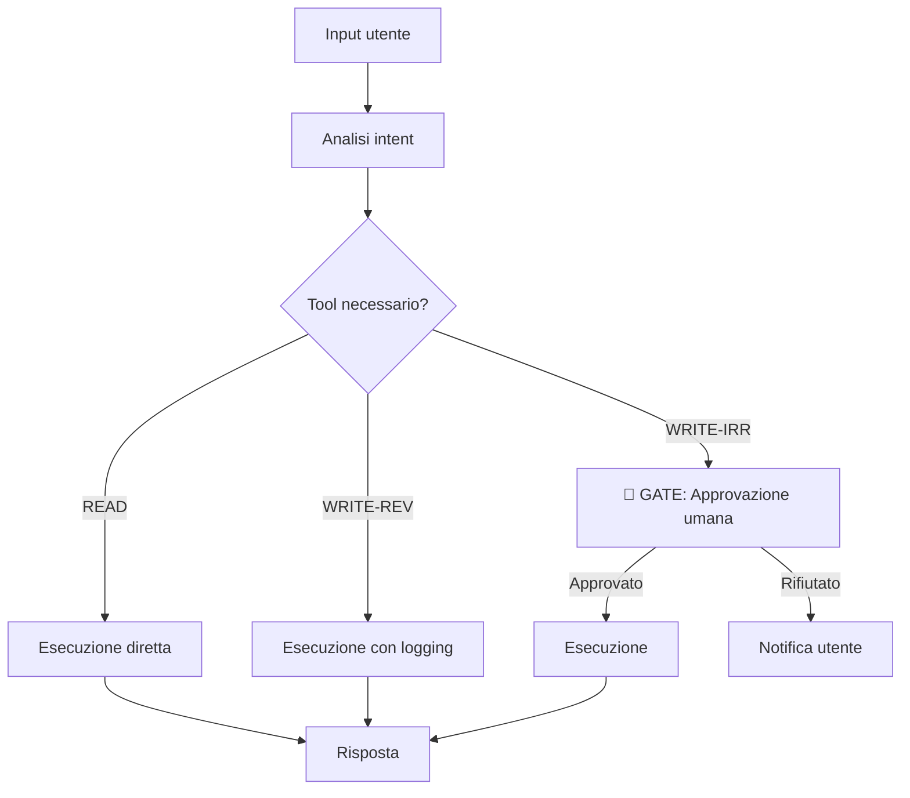

# Pratiche — Sistemi Agentici

Questa sezione definisce come implementare gli standard [S18](../standards/agentic-systems.md#s18--tool-safety-definition) attraverso [S23](../standards/agentic-systems.md#s23--cost-control).

Queste pratiche si applicano in aggiunta a tutte le pratiche generali, non in sostituzione.

---

## P18 — Tool Safety

### Minimo

**Tool registry in `docs/tools-registry.md`:**

```markdown
# Tool Registry

## tool_name

**Descrizione:** Cosa fa il tool.
**Classe:** READ | WRITE-REV | WRITE-IRR
**Input:** Parametri accettati con tipo e descrizione
**Output:** Struttura del risultato
**Vincoli:** Limiti espliciti sull'utilizzo
**Approvazione richiesta:** Sì / No
**Ultima verifica:** YYYY-MM-DD
```

**Implementazione obbligatoria per tool WRITE-IRR:**

```python
from functools import wraps
from typing import Callable, Any

def require_human_approval(tool_func: Callable) -> Callable:
    """
    Decorator obbligatorio per tutti i tool classificati WRITE-IRR.
    In produzione blocca l'esecuzione fino ad approvazione esplicita.
    """
    @wraps(tool_func)
    def wrapper(*args: Any, **kwargs: Any) -> Any:
        if settings.environment == "prod":
            approval = request_human_approval(
                tool_name=tool_func.__name__,
                parameters=kwargs,
            )
            if not approval.approved:
                raise ToolExecutionDenied(
                    f"Esecuzione di {tool_func.__name__} rifiutata dall'operatore."
                )
            log.info(
                "tool_execution_approved",
                tool=tool_func.__name__,
                approved_by=approval.approver_id,
            )
        return tool_func(*args, **kwargs)
    return wrapper


# Utilizzo
@require_human_approval
def send_email_notification(ticket_id: str, recipient: str, body: str) -> dict:
    ...
```

**Logging obbligatorio su ogni tool call:**

```python
def log_tool_call(tool_name: str, inputs: dict, output: Any, duration_ms: float) -> None:
    log.info(
        "tool_call_executed",
        tool=tool_name,
        inputs=inputs,
        output_type=type(output).__name__,
        duration_ms=duration_ms,
        success=True,
    )
```

### Consigliato

- Tool wrapper con validazione Pydantic su input e output
- Tool permission system — ogni agent role ha accesso solo ai tool necessari

### Avanzato

- Dynamic tool permissions basate su contesto e ruolo dell'utente che ha avviato il task
- Automated tool safety audit su ogni deploy

---

## P19 — Human-in-the-Loop

### Minimo

**Diagramma del flusso agentico con gate espliciti:**



**Implementazione gate come logica esplicita:**

```python
class AgentExecutor:
    def execute_tool(self, tool: Tool, params: dict) -> ToolResult:
        # Il gate NON è delegato all'LLM
        # È logica esplicita nel codice
        if tool.safety_class == ToolSafetyClass.WRITE_IRR:
            if not self._get_human_approval(tool, params):
                return ToolResult(
                    success=False,
                    error="Esecuzione rifiutata — approvazione umana non ottenuta",
                )

        return tool.execute(**params)

    def _get_human_approval(self, tool: Tool, params: dict) -> bool:
        # Implementazione del meccanismo di approvazione
        # Sincrono: attesa risposta operatore
        # Asincrono: notifica + callback
        ...
```

### Consigliato

**Gradual autonomy — processo documentato:**

```markdown
# Gradual Autonomy Log — [Nome Agente]

## WRITE-REV autonomy — [nome tool]

**Data:** YYYY-MM-DD
**Gate rimosso:** tool_update_ticket_status
**Evidenza empirica:**
- 200 esecuzioni monitorate in staging
- 0 errori di classificazione
- 0 richieste di rollback
**Approvato da:** [nome]
**ADR di riferimento:** ADR-012
```

La rimozione di qualsiasi gate richiede un ADR con evidenza empirica documentata.

### Avanzato

- Policy-based autonomy engine — regole configurabili che determinano quando l'agente può agire senza approvazione
- Audit trail completo con firma digitale per compliance

---

## P20 — Agentic Eval

### Minimo

**Struttura della suite di eval in `tests/evals/`:**

```
tests/evals/
├── README.md                    # Descrizione della suite e istruzioni di esecuzione
├── scenarios/
│   ├── task_completion/         # Scenari di completamento task
│   ├── failure_handling/        # Gestione degli errori
│   ├── out_of_scope/            # Comportamento fuori perimetro
│   └── ambiguous_input/         # Gestione input ambigui
├── fixtures/                    # Dati di test riutilizzabili
└── run_evals.py                 # Script di esecuzione della suite
```

**Formato scenario obbligatorio:**

```python
# tests/evals/scenarios/task_completion/test_priority_assignment.py

import pytest
from src.agents import TicketAgent

SCENARIOS = [
    {
        "id": "TC-001",
        "description": "Ticket urgente con descrizione esplicita di blocco produzione",
        "input": "Il sistema di pagamento è down, tutti gli ordini falliscono",
        "expected_priority": 1,
        "expected_tools_called": ["get_ticket_context", "update_ticket_priority"],
        "max_steps": 3,
    },
    {
        "id": "TC-002",
        "description": "Ticket di bassa priorità — richiesta feature",
        "input": "Sarebbe utile avere un dark mode nell'interfaccia",
        "expected_priority": 4,
        "expected_tools_called": ["get_ticket_context", "update_ticket_priority"],
        "max_steps": 3,
    },
]

@pytest.mark.parametrize("scenario", SCENARIOS, ids=[s["id"] for s in SCENARIOS])
def test_task_completion(scenario: dict, agent: TicketAgent) -> None:
    result = agent.run(scenario["input"])

    assert result.priority == scenario["expected_priority"], (
        f"Scenario {scenario['id']}: expected priority {scenario['expected_priority']}, "
        f"got {result.priority}"
    )
    assert result.steps_count <= scenario["max_steps"], (
        f"Scenario {scenario['id']}: exceeded max steps "
        f"({result.steps_count} > {scenario['max_steps']})"
    )
```

**Esecuzione e report:**

```bash
make eval  # Esegue la suite completa con report

# Output atteso
# tests/evals/reports/eval-report-YYYY-MM-DD.json
```

### Consigliato

**LangSmith per tracing e eval** (stack LangChain):

```python
from langsmith import Client
from langsmith.evaluation import evaluate

client = Client()

# Dataset di eval su LangSmith
dataset = client.create_dataset("ticket-agent-eval-v1")

# Esecuzione eval con LangSmith
results = evaluate(
    agent.run,
    data=dataset,
    evaluators=[
        priority_correctness_evaluator,
        steps_efficiency_evaluator,
        out_of_scope_evaluator,
    ],
)
```

### Avanzato

- Eval automatizzata in CI/CD — ogni PR che tocca l'agente esegue la suite
- Red teaming sistematico prima di ogni deploy in produzione
- Eval dataset versionato con DVC

---

## P21 — Agentic Observability

### Minimo

**Tracing completo di ogni esecuzione:**

```python
import uuid
from dataclasses import dataclass, field
from datetime import datetime

@dataclass
class AgentTrace:
    execution_id: str = field(default_factory=lambda: str(uuid.uuid4()))
    started_at: datetime = field(default_factory=datetime.utcnow)
    input: str = ""
    steps: list[StepTrace] = field(default_factory=list)
    total_tokens: int = 0
    total_cost_usd: float = 0.0
    result: str = ""
    success: bool = False
    failure_reason: str | None = None
    finished_at: datetime | None = None

    def add_step(self, step: "StepTrace") -> None:
        self.steps.append(step)
        self.total_tokens += step.tokens_used
        self.total_cost_usd += step.cost_usd

    def finalize(self, result: str, success: bool, failure_reason: str | None = None) -> None:
        self.result = result
        self.success = success
        self.failure_reason = failure_reason
        self.finished_at = datetime.utcnow()
        log.info(
            "agent_execution_completed",
            execution_id=self.execution_id,
            success=self.success,
            steps_count=len(self.steps),
            total_tokens=self.total_tokens,
            total_cost_usd=self.total_cost_usd,
            duration_ms=(self.finished_at - self.started_at).total_seconds() * 1000,
            failure_reason=self.failure_reason,
        )
```

### Consigliato

**LangSmith per tracing nativo su stack LangChain:**

```python
import os
os.environ["LANGCHAIN_TRACING_V2"] = "true"
os.environ["LANGCHAIN_PROJECT"] = "project-name"

# Il tracing è automatico su tutti i componenti LangChain
```

- Dashboard con metriche aggregate: task completion rate, costo medio per task, latenza media
- Alert su anomalie di costo o failure rate

### Avanzato

- Custom observability platform con correlazione tra trace e business metrics
- Automated anomaly detection su pattern di esecuzione agentici

---

## P22 — Perimeter Definition

### Minimo

File `docs/agent-perimeter.md` basato sul template in [templates/agent-perimeter.md](../templates/agent-perimeter.md).

**Struttura obbligatoria:**

```markdown
# Perimetro Operativo — [Nome Agente]

## In scope

Lista esplicita dei task supportati:
- Task 1: descrizione e criteri di completamento
- Task 2: ...

## Out of scope

Lista esplicita dei task NON supportati:
- Task A: motivo dell'esclusione
- Task B: ...

## Comportamento fuori perimetro

Risposta standard quando riceve una richiesta fuori scope:
> "[Testo esatto della risposta]"

Escalation path: [descrizione di cosa succede — notifica, redirect, log]

## Edge cases documentati

Casi limite e comportamento atteso per ciascuno.
```

**Implementazione del perimetro nel codice:**

```python
class AgentPerimeter:
    """
    Il comportamento fuori perimetro è implementato nel codice,
    non delegato alla decisione dell'LLM.
    """

    IN_SCOPE_INTENTS = {
        "assign_priority",
        "categorize_ticket",
        "route_to_team",
        "request_information",
    }

    OUT_OF_SCOPE_RESPONSE = (
        "Questa richiesta è fuori dal perimetro del sistema di gestione ticket. "
        "Per assistenza su questo argomento, contattare [canale appropriato]."
    )

    def is_in_scope(self, intent: str) -> bool:
        return intent in self.IN_SCOPE_INTENTS

    def handle_out_of_scope(self, request: str) -> AgentResponse:
        log.warning(
            "out_of_scope_request",
            request_preview=request[:100],
        )
        return AgentResponse(
            content=self.OUT_OF_SCOPE_RESPONSE,
            in_scope=False,
        )
```

### Consigliato

- Monitoring delle richieste fuori perimetro in produzione — indicatore di gap nel perimetro dichiarato
- Review trimestrale del perimetro basata sui dati di produzione

---

## P23 — Cost Control

### Minimo

**Budget per esecuzione implementato nel codice:**

```python
@dataclass
class ExecutionBudget:
    max_steps: int = 10
    max_tool_calls: int = 15
    max_tokens: int = 10_000
    max_cost_usd: float = 0.50


class BudgetEnforcer:
    def __init__(self, budget: ExecutionBudget) -> None:
        self.budget = budget

    def check(self, trace: AgentTrace) -> None:
        """
        Chiamato dopo ogni step. Lancia BudgetExceeded se il budget è superato.
        Non è un warning — è un'interruzione controllata.
        """
        if len(trace.steps) >= self.budget.max_steps:
            raise BudgetExceeded(
                f"Max steps exceeded: {len(trace.steps)} >= {self.budget.max_steps}",
                budget_type="steps",
                trace=trace,
            )

        if trace.total_tokens >= self.budget.max_tokens:
            raise BudgetExceeded(
                f"Max tokens exceeded: {trace.total_tokens} >= {self.budget.max_tokens}",
                budget_type="tokens",
                trace=trace,
            )

        if trace.total_cost_usd >= self.budget.max_cost_usd:
            raise BudgetExceeded(
                f"Max cost exceeded: ${trace.total_cost_usd:.4f} >= ${self.budget.max_cost_usd}",
                budget_type="cost_usd",
                trace=trace,
            )
```

**Alert su costo anomalo:**

```python
# Eseguito dopo ogni esecuzione completata
def check_cost_alert(trace: AgentTrace, baseline_cost: float) -> None:
    if trace.total_cost_usd > baseline_cost * 2:
        log.warning(
            "cost_anomaly_detected",
            execution_id=trace.execution_id,
            cost_usd=trace.total_cost_usd,
            baseline_usd=baseline_cost,
            ratio=trace.total_cost_usd / baseline_cost,
        )
```

### Consigliato

- Cost attribution per tipo di task — identifica quali task costano di più
- Weekly cost report automatico con trend e anomalie
- Budget rivisto periodicamente sulla base dei dati di produzione

### Avanzato

- Automated model routing — task classificati per complessità, modelli meno costosi per task semplici
- Cost forecasting per capacity planning e budget cliente
