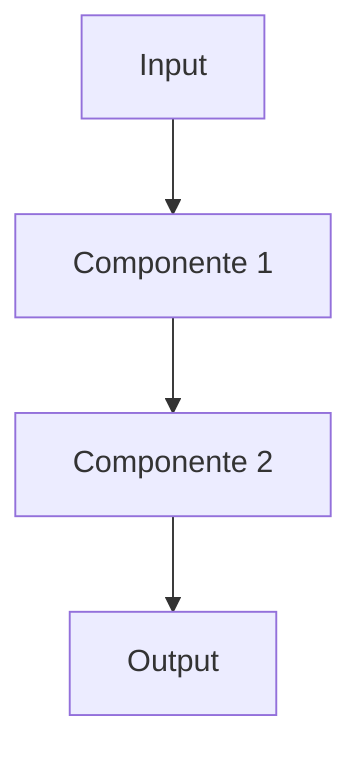

# Pratiche — Architettura e Decisioni

Questa sezione definisce come implementare gli standard [S01](../standards/architecture.md#s01--architecture-document) e [S02](../standards/architecture.md#s02--architecture-decision-records).

Le pratiche sono organizzate su tre livelli: **Minimo** (obbligatorio), **Consigliato** (target per progetti in produzione), **Avanzato** (obiettivo di maturità della practice).

---

## P01 — Architecture Document

### Minimo

File `docs/architecture.md` che risponde obbligatoriamente a:

1. **Cosa fa il sistema** — descrizione funzionale in linguaggio non tecnico
2. **Componenti principali** — lista con responsabilità di ciascuno
3. **Flussi principali** — come i dati e le richieste attraversano il sistema
4. **Integrazioni esterne** — sistemi terzi, API, database
5. **Vincoli e trade-off** — decisioni architetturali rilevanti e perché

Un diagramma testuale è sufficiente al livello minimo. Mermaid integrato nel markdown è accettabile:



### Consigliato

- Diagramma architetturale esplicito — non solo testo
- Sezione dedicata ai failure modes e come il sistema li gestisce
- Sezione sulla strategia di scaling se rilevante per il contesto
- Il documento viene aggiornato ad ogni modifica architetturale significativa — non a fine progetto

### Avanzato

**C4 Model** come standard di diagrammazione:

| Livello | Descrizione | Audience |
|---|---|---|
| Context | Il sistema nel suo ecosistema — utenti e sistemi esterni | Stakeholder non tecnici |
| Container | Applicazioni, database, servizi che compongono il sistema | Sviluppatori e architetti |
| Component | Componenti interni di ogni container | Sviluppatori |
| Code | Classi e interfacce — solo dove necessario | Sviluppatori |

Tool consigliati: [Structurizr](https://structurizr.com/), diagrammi C4 con PlantUML, draw.io con libreria C4.

---

## P02 — Architecture Decision Records

### Minimo

Cartella `docs/decisions/` con ADR in formato markdown numerati progressivamente.

**Formato minimo obbligatorio:**

```markdown
# ADR-NNN — Titolo della decisione

**Data:** YYYY-MM-DD
**Stato:** Proposto | Accettato | Deprecato | Sostituito da ADR-NNN

## Contesto

Perché questa decisione era necessaria. Quale problema stava risolvendo.
Quali vincoli o requisiti erano rilevanti.

## Decisione

Cosa abbiamo deciso. Formulato in modo affermativo e diretto.

## Alternative considerate

| Alternativa | Motivo del rifiuto |
|---|---|
| Alternativa A | Perché non è stata scelta |
| Alternativa B | Perché non è stata scelta |

## Conseguenze

Cosa cambia con questa decisione. Trade-off accettati.
Cosa diventa più facile. Cosa diventa più difficile.
```

**Regole operative:**

- Gli ADR sono scritti prima di implementare la decisione
- Gli ADR non vengono modificati — se una decisione cambia, si crea un nuovo ADR che sostituisce il precedente
- Il campo Stato viene aggiornato quando la decisione cambia
- Numerazione progressiva: ADR-001, ADR-002, ...

### Consigliato

- Review degli ADR in fase di MR per le decisioni più impattanti
- ADR collegati agli issue che li hanno motivati
- Template come file separato nel repository — vedere [templates/adr-template.md](../templates/adr-template.md)

### Avanzato

- ADR come parte del processo di onboarding — i nuovi membri leggono gli ADR prima di iniziare a contribuire
- ADR review periodica — identificazione di decisioni da rivalutare alla luce dell'evoluzione del sistema
