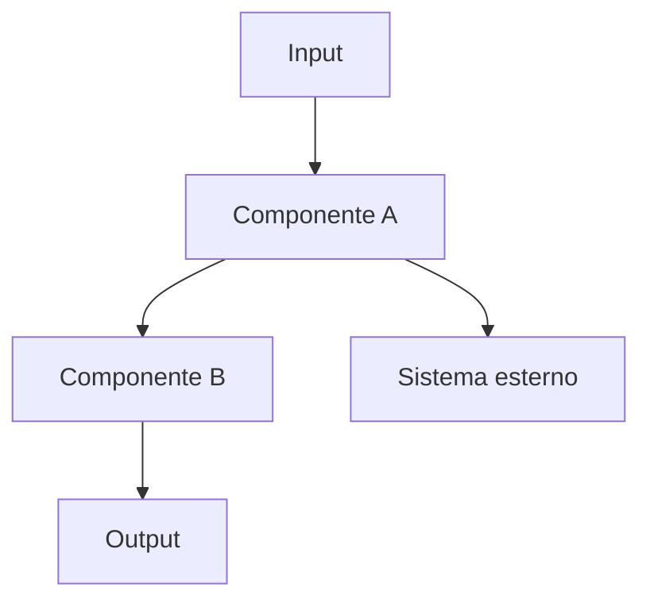

# Architettura — [Nome Sistema]

**Versione:** x.x.x
**Ultima modifica:** YYYY-MM-DD
**Autore:** [nome]
**Stato:** Draft | Review | Approvato

---

## Panoramica

Descrizione funzionale del sistema in linguaggio non tecnico. Cosa fa, per chi, quale problema risolve.

---

## Contesto e vincoli

Vincoli tecnici, operativi o di business che hanno influenzato le scelte architetturali.

- **Vincolo 1:** descrizione
- **Vincolo 2:** descrizione

---

## Componenti principali

| Componente | Responsabilità | Tecnologia |
|---|---|---|
| Componente A | Cosa fa | Tool/framework |
| Componente B | Cosa fa | Tool/framework |

---

## Diagramma architetturale

*Sostituire con diagramma accurato del sistema reale.*

---

## Flussi principali

### Flusso 1 — [Nome flusso]

Descrizione step-by-step del flusso principale.

1. Step 1
2. Step 2
3. Step 3

### Flusso 2 — [Nome flusso]

...

---

## Integrazioni esterne

| Sistema | Tipo di integrazione | Protocollo | Note |
|---|---|---|---|
| Sistema A | Lettura | REST API | Autenticazione OAuth2 |
| Sistema B | Scrittura | Webhook | Retry su failure |

---

## Decisioni architetturali rilevanti

Riepilogo delle decisioni più importanti con link agli ADR corrispondenti.

| Decisione | ADR | Motivazione sintetica |
|---|---|---|
| Scelta framework agente | [ADR-001](decisions/ADR-001-nome.md) | Motivazione |
| Strategia di retry | [ADR-002](decisions/ADR-002-nome.md) | Motivazione |

---

## Failure modes e gestione

| Failure | Probabilità | Impatto | Gestione |
|---|---|---|---|
| Timeout chiamata esterna | Media | Medio | Retry con backoff esponenziale |
| LLM non disponibile | Bassa | Alto | Circuit breaker + fallback |

---

## Considerazioni di sicurezza

- Come vengono gestiti i secret
- Dati sensibili — dove transitano, come vengono protetti
- Superfici di attacco identificate e mitigazioni

---

## Changelog architetturale

| Data | Modifica | Autore |
|---|---|---|
| YYYY-MM-DD | Versione iniziale | [nome] |
